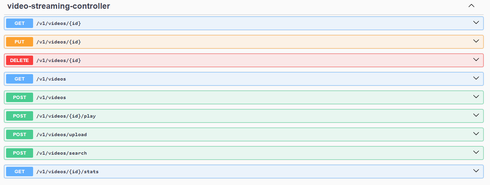

# 📄 Video Streaming API

## Description

Backend API service that manages **videos**. The service must allow users to upload, search, and download videos while efficiently handling resources.

## Technologies Used

- Java 17
- Spring Boot
- H2
- Liquibase
- Docker
- GitHub Actions(CI/CD)
- Swagger
- Postman


## Endpoints

| Method | Endpoint              | Description |
| ------ |-----------------------| ----------- |
| GET    | /v1/videos            | Get all videos |
| GET    | /v1/videos/{id}       | Get video by id |
| GET    | /v1/videos/{id}/stats | Get video stats by id |
| POST   | /v1/videos            | Publish video |
| POST   | /v1/videos/upload     | Upload video |
| POST   | /v1/videos/search     | Search videos |
| POST   | /v1/videos/{id}/play  | Play video by id |
| PUT    | /v1/videos/{id}       | Update video by id |
| DELETE | /v1/videos/{id}       | Delete video by id |



## Testing the application

To test the application, use the following command:

```
docker-compose up --build

```
or
```
mvn spring-boot:run
```


## Run tests

To run tests, use the following command:

```
mvn verify
```

## Swagger

The Swagger documentation is available at http://localhost:8080/api/swagger-ui/index.html.

## Postman

Postman collections are available in the `docs` folder.


## CI/CD

The application is configured to run on GitHub Actions. The following workflows are configured:

- `develop.yml`: Builds the application and runs tests on every push to the `develop` branch.
- `prd.yml`: Builds the application and runs tests on every push to the `main` branch.

Please sse the action after pull request on related branchs (https://github.com/marvini86/video-api/actions)
